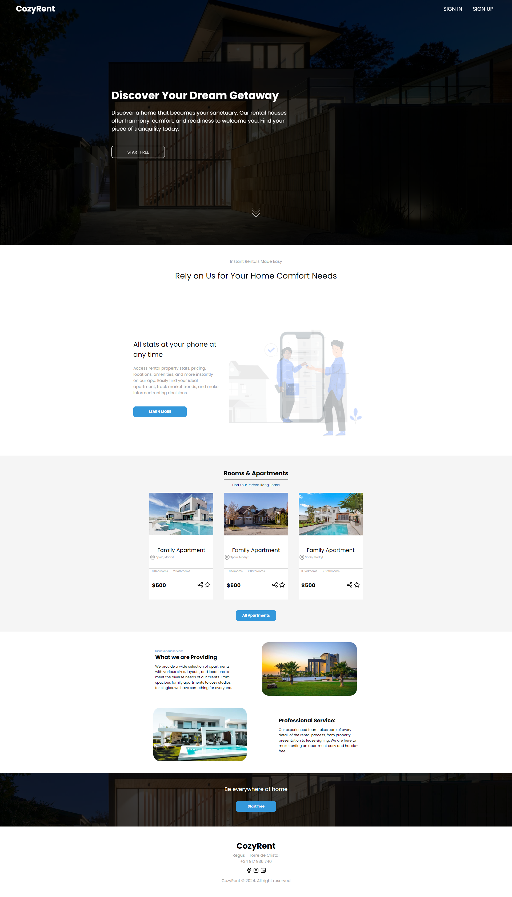

# CozyRent 🏡 - HomePage

**CozyRent** is a simple, one-page website designed for apartment rentals. The site aims to present essential information about available listings and provides an intuitive way for users to contact and book apartments.

## 🌟 Project Overview

- **HTML**: Structure of the website and its elements.
- **CSS**: Styling for a responsive and attractive look.
- **JavaScript**: Interactivity, handling dynamic elements such as contact forms and offer sliders.

## 🚀 Technologies Used

 
 
 

